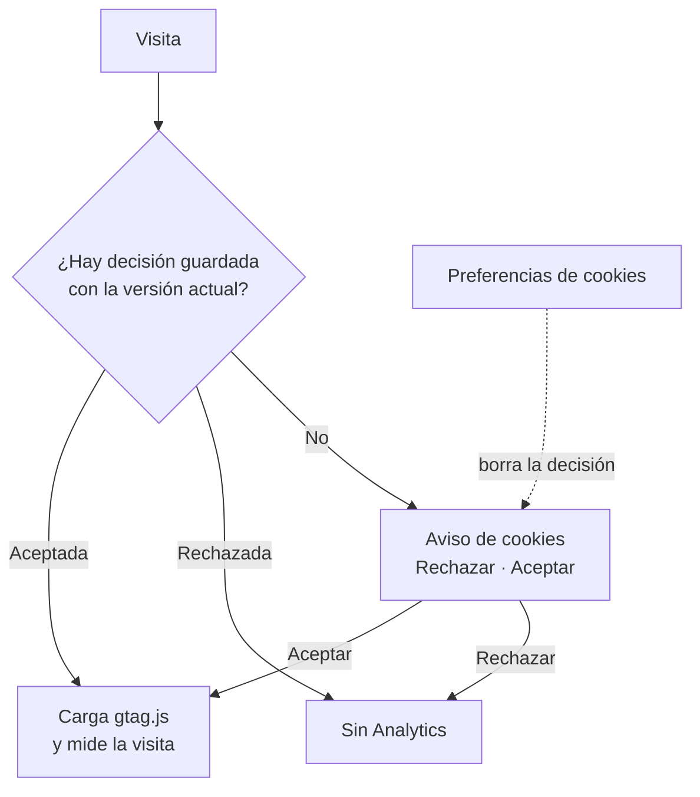

# Analítica y cookies

[Índice](README.md)

Google Analytics 4 mide el uso de la web solo si la persona acepta en el aviso de cookies (paso 1.1, caso OA-34).

- **ID de medición:** `G-NS7J78VF65`, en `apps/web/.env.production` como `VITE_GA_MEASUREMENT_ID`. No es secreto. En `pnpm dev` no se define, así que en local no hay aviso ni Analytics.
- **El aviso bloquea la página:** es un diálogo modal (Radix AlertDialog) con el fondo oscurecido. Mientras no se elige, no se puede usar la página; al pulsar fuera o Esc, el aviso hace un pequeño rebote (un destello si el sistema pide reducir el movimiento). «Aceptar» va en estilo principal y siempre tiene el foco: al abrir, al pulsar fuera y al pulsar dentro del aviso (salvo en «Rechazar»), así que Enter acepta. El texto del aviso no se puede seleccionar.
- **Antes de decidir o si se rechaza:** el script de Google no se carga y no sale ninguna petición hacia Google.
- **Si se acepta:** se carga `gtag.js` con el modo de consentimiento (analítica sí, publicidad no). Las páginas vistas al cambiar de ruta las cuenta la medición mejorada de GA4.
- **Cambiar de opinión:** «Preferencias de cookies» en la página de inicio y en el menú de usuario vuelve a mostrar el aviso. Si se retira el consentimiento, se desactiva la etiqueta, se borran las cookies `_ga` y se recarga la página.
- **Dónde se guarda la decisión:** en `localStorage`, clave `ccc-consent`, con la versión del aviso. Si cambia el texto del aviso, se sube `CONSENT_VERSION` en `src/consent/consent.ts` y se vuelve a preguntar a todos.
- **Preferencias de la web:** el tema (`ccc-theme`) se guarda en el dispositivo y no necesita consentimiento.

## Comprobarlo

En la vista en tiempo real de Analytics (Informes > Tiempo real): al rechazar no aparece la visita; al aceptar, sí.
