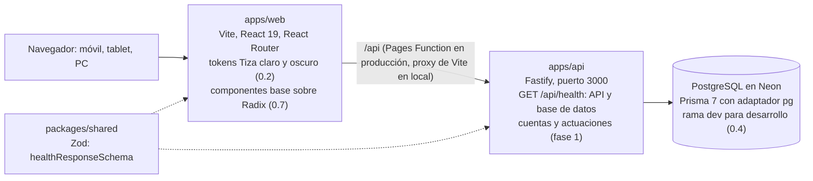

# Arquitectura

[Índice](README.md)

La web habla solo con su propia dirección: en producción, una Pages Function reenvía `/api/*` a la API; en local lo hace el proxy de Vite. Lo que aún no existe se construye en los pasos indicados.

