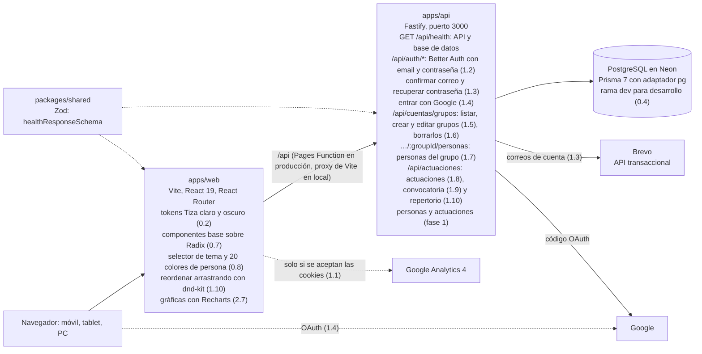

# Arquitectura

[Índice](README.md)

La web habla solo con su propia dirección: en producción, una Pages Function reenvía `/api/*` a la API; en local lo hace el proxy de Vite. Lo que aún no existe se construye en los pasos indicados.

**Barras de scroll:** una zona que se desplaza nunca estrecha su contenido: su barra ocupa sitio del margen derecho (mixin `scroll-y` y `scrollbar-gutter: stable`, con el ancho de la barra medido al arrancar en `--scrollbar-size`), y ese hueco se guarda siempre, para que nada se mueva cuando la barra aparece o se va. Así van el editor y el resumen de la actuación, la tarjeta del repertorio, las partes del resumen y la lista de Mi grupo.

**Quitar en rojo:** todo botón que quita, borra o elimina va en rojo (`variant="danger"` en `Button`, `danger` en los menús, o el color `--danger` en los botones de icono: la × de las etiquetas, la papelera de los instrumentos, el − de quitar un hueco, la franja de soltar para quitar). Los que solo cierran (la × de diálogos y avisos) no.

**Transiciones:** todo cambio de estado (hover, seleccionado, abierto, eliminar…) dura 0,2 s: el token `--duration` y `--state-transition` (color, fondo, borde, contorno, sombra y opacidad) en `styles/_tokens.scss`. Los controles (botones, enlaces, campos, pestañas, opciones) lo llevan de serie desde `styles/global.scss`, y los pliegues y flechas de la app usan la misma duración. Con «reducir movimiento» en el sistema es 0 s.

**Acceso a la API:** solo a través de la web. El proxy añade la clave `PROXY_SECRET` y la IP del visitante; la API rechaza lo demás salvo `/api/health`.

**Sesión:** Better Auth guarda la sesión en la cookie `better-auth.session_token` (HttpOnly, SameSite=Lax, 30 días que se renuevan con el uso). Como la web y la API comparten dirección gracias al proxy, la cookie es de la propia web y funciona igual en el móvil y en el PC. Más detalle en [Seguridad de las cuentas](security.md).
