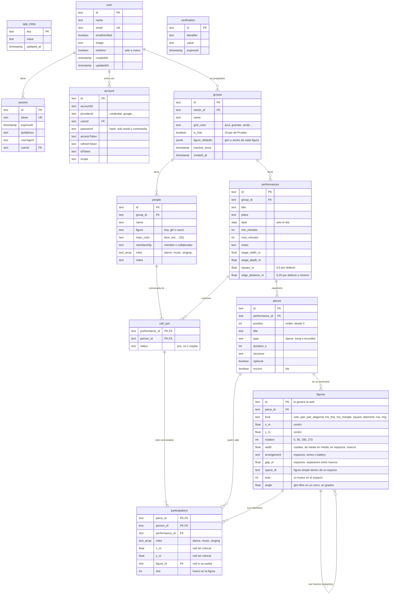
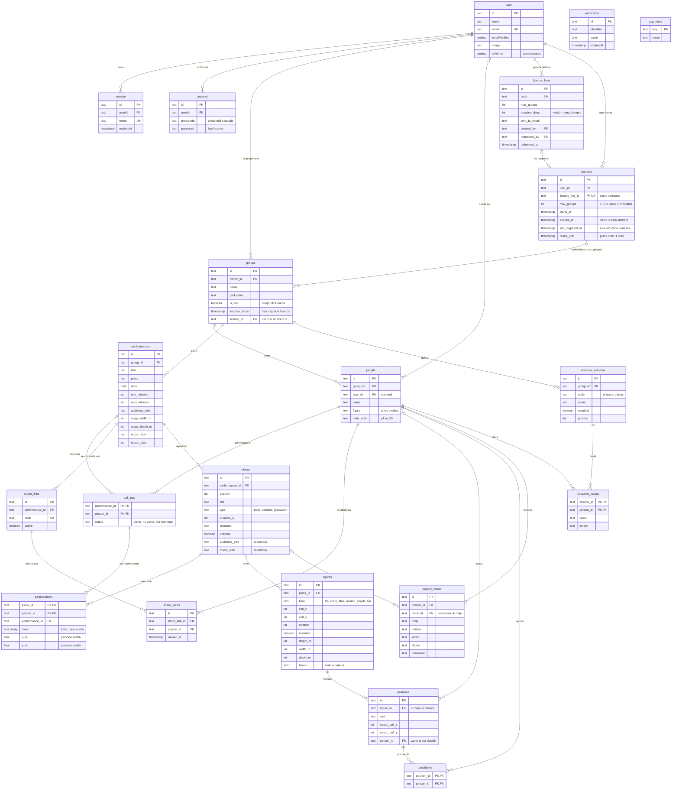

# Base de datos

[Índice](README.md)

PostgreSQL en Neon con Prisma 7. El esquema está en `apps/api/prisma/schema.prisma` y las migraciones en `apps/api/prisma/migrations`.

Migraciones:

- `20260930144317_init` (paso 0.4): tabla técnica `app_meta`.
- `20261001132908_auth` (paso 1.2): tablas de Better Auth para las cuentas.
- `20261002083115_groups` (paso 1.5): grupos de cada usuario.
- `20261002101204_people` (paso 1.7): personas de cada grupo.
- `20261002131629_performances` (paso 1.8): actuaciones de cada grupo.
- `20261002135920_performance_stage`: medidas del escenario y metros por cuadrado de cada actuación.
- `20261002175748_stage_edge_distance`, `20261003094303_default_half_metre_square` y `20261003094432_default_quarter_metre_edge` (paso 1.8.1): borde del escenario, cuadrado de 0,5 m y borde de 0,25 m por defecto.
- `20261003100841_call_ups` (paso 1.9): tipo de persona (miembro o colaborador) y convocatoria de cada actuación.
- `20261003123935_person_roles`: roles de cada persona (baile, música, canto…).
- `20261004093000_pieces` (paso 1.10): repertorio de cada actuación, en orden.
- `20261004193000_participations` (paso 1.11): quién sale en cada pieza y qué hace.
- `20261004210000_piece_encore` (paso 1.12): piezas de bis, aparte del repertorio.
- `20261005090000_user_admin`: marca de administrador de la plataforma (`isAdmin`).
- `20261005100000_participation_position` (paso 2.1): dónde está cada persona en cada pieza (`x_m`, `y_m`).
- `20261005150000_figures` (paso 2.2): figuras de cada pieza, a qué figura y hueco pertenece cada participación y la configuración de figuras de cada grupo (`figure_defaults`).
- `20261005220000_spaces` (paso 2.3): espacios (fila y corro) como figuras; cada figura simple puede ir en el hueco de un espacio (`space_id`, `hole`), con su disposición (`arrangement`) y un giro libre dentro de un corro (`angle`).
- `20261005230000_space_gap` (paso 2.3): separación entre los huecos de un espacio, en metros (`gap_m`; 0,5 por defecto).

Las tablas de Better Auth (`user`, `session`, `account`, `verification`) usan sus nombres por defecto, en singular y con columnas en camelCase, porque Better Auth comprueba el esquema al arrancar. El resto de tablas usa nombres en inglés y columnas en snake_case. Tras cambiar `schema.prisma`, ejecuta `pnpm --filter @cuadrocorrocalle/api db:migrate` y después `db:generate`.

## Modelo completo previsto

Todas las tablas del plan, incluidas las que aún no existen. Cada una se crea en el paso que la necesita; el nombre de la fase o del paso aparece en algunas columnas. Las reglas de licencias están en [Licencias](licensing.md).

`participations` apunta a la convocatoria (`performance_id` + `person_id`), así que la base de datos impide que salga en una pieza alguien no convocado.

## Ramas de Neon

- `dev`: desarrollo en local, desde `apps/api/.env`.
- Principal: producción, configurada en Render.
