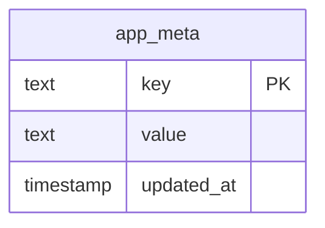

# Base de datos

[Índice](README.md)

PostgreSQL en Neon con Prisma 7. El esquema está en `apps/api/prisma/schema.prisma` y las migraciones en `apps/api/prisma/migrations`.

Primera migración: `20260930144317_init` (paso 0.4). De momento solo hay una tabla técnica; las tablas de usuario llegan con Better Auth en el paso 1.2 y las del modelo en la fase 1.

## Ramas de Neon

- `dev`: desarrollo en local, desde `apps/api/.env`.
- Principal: producción, configurada en Render.
