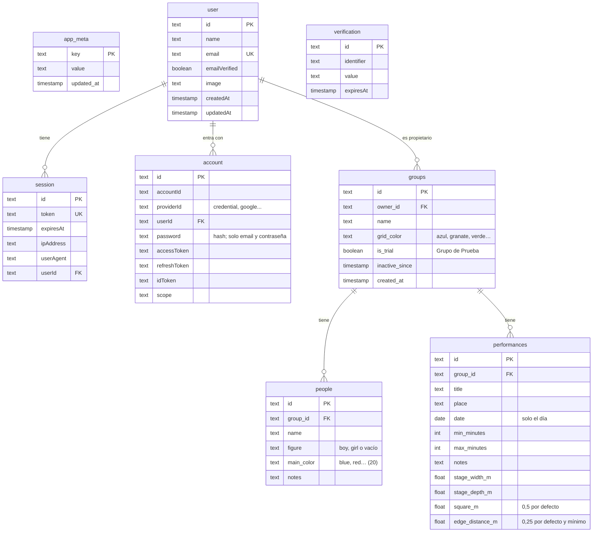
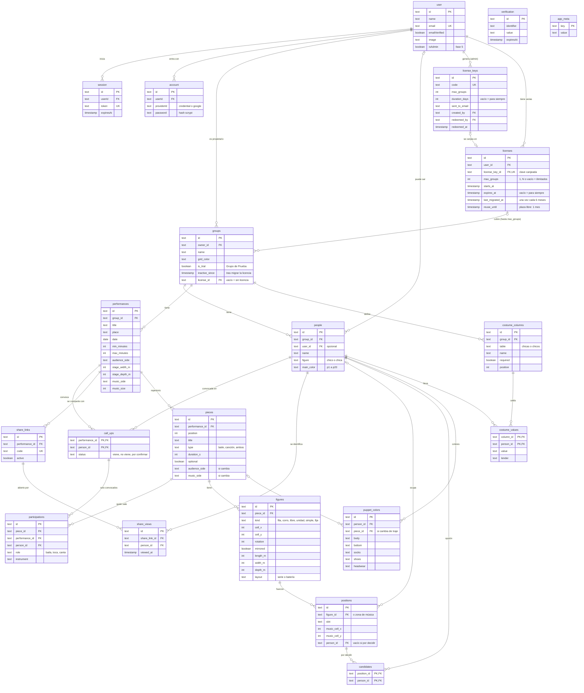

# Base de datos

[Índice](README.md)

PostgreSQL en Neon con Prisma 7. El esquema está en `apps/api/prisma/schema.prisma` y las migraciones en `apps/api/prisma/migrations`.

Migraciones:

- `20260930144317_init` (paso 0.4): tabla técnica `app_meta`.
- `20261001132908_auth` (paso 1.2): tablas de Better Auth para las cuentas.
- `20261002083115_groups` (paso 1.5): grupos de cada usuario.
- `20261002101204_people` (paso 1.7): personas de cada grupo.
- `20261002131629_performances` (paso 1.8): actuaciones de cada grupo.
- `20261002135920_performance_stage`: medidas del escenario y metros por cuadrado de cada actuación.

Las tablas de Better Auth (`user`, `session`, `account`, `verification`) usan sus nombres por defecto, en singular y con columnas en camelCase, porque Better Auth comprueba el esquema al arrancar. El resto de tablas usa nombres en inglés y columnas en snake_case. Tras cambiar `schema.prisma`, ejecuta `pnpm --filter @cuadrocorrocalle/api db:migrate` y después `db:generate`.

## Modelo completo previsto

Todas las tablas del plan, incluidas las que aún no existen. Cada una se crea en el paso que la necesita; el nombre de la fase o del paso aparece en algunas columnas. Las reglas de licencias están en [Licencias](licensing.md).

`participations` apunta a la convocatoria (`performance_id` + `person_id`), así que la base de datos impide que salga en una pieza alguien no convocado.

## Ramas de Neon

- `dev`: desarrollo en local, desde `apps/api/.env`.
- Principal: producción, configurada en Render.
