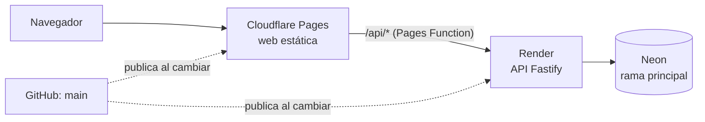

# Publicación

[Índice](README.md)

La web va en Cloudflare Pages, la API en Render y la base de datos en Neon. Cloudflare y Render publican solos cada vez que cambia `main`. Montado en el paso 0.6 (30 de septiembre de 2026).



## Neon (base de datos)

- Rama `dev`: desarrollo en local (`apps/api/.env`, fuera de git).
- Rama principal: producción. Sus dos cadenas de conexión (con `-pooler` y sin él) van en Render.

### Administrador de la plataforma

Ver `/status` y `/componentes` exige `isAdmin` en la tabla `user`. Nadie puede ponérselo desde la web: se marca a mano en el editor SQL de Neon, en cada rama (desarrollo y producción), y hay que repetirlo si se restaura o se copia la base de datos:

```sql
UPDATE "user" SET "isAdmin" = true WHERE "email" = '<correo del administrador>';
```

La cuenta tiene que existir antes (entrar una vez con ella). Tras el cambio, basta con recargar la web.

## Render (API)

1. New > Blueprint y elegir el repositorio `juananmgz/cuadrocorrocalle`: Render lee `render.yaml`.
2. Rellenar `DATABASE_URL` (cadena con `-pooler`) y `DIRECT_URL` (cadena sin `-pooler`) de la rama principal de Neon.
3. `PROXY_SECRET`: la misma clave larga y aleatoria que en Cloudflare Pages (`openssl rand -hex 32`). Con ella, la API solo atiende peticiones que llegan por la web.
4. `BREVO_API_KEY` (clave de API de Brevo) y `EMAIL_FROM` (remitente verificado en Brevo) para los correos de confirmación y de recuperar la contraseña.
5. `GOOGLE_CLIENT_ID` y `GOOGLE_CLIENT_SECRET` del cliente OAuth de Google (ver «Google Cloud» abajo).
6. `BETTER_AUTH_SECRET` lo genera Render (`generateValue`) y `BETTER_AUTH_URL` es la dirección pública de la web (`https://cuadrocorrocalle.pages.dev`), porque la sesión vive en una cookie de esa dirección. Si el Blueprint no se sincroniza solo, se añaden a mano en Environment.
7. Al terminar, anotar la dirección del servicio (`https://….onrender.com`).

La compilación genera el cliente de Prisma de forma explícita (`db:generate`) antes de aplicar las migraciones: no basta con el `postinstall`, que pnpm se salta cuando reutiliza la caché de Render, y entonces la API no arranca (`Cannot find module …/generated/prisma/client`). Si el Blueprint no se sincroniza solo, el «Build Command» se cambia a mano en Settings.

En cada publicación se aplican las migraciones pendientes (`prisma migrate deploy`). La comprobación de salud es `/api/health`.

## Cloudflare Pages (web)

El proyecto se crea desde el enlace «Continue to Pages», no desde el flujo de Workers.

1. Workers & Pages > Create > Pages > Connect to Git y elegir el repositorio.
2. Ajustes de build:
   - Production branch: `main`
   - Root directory: `apps/web`
   - Build command: `pnpm build`
   - Build output directory: `dist`
3. Variables de entorno:
   - `NODE_VERSION`: `22.20.0`
   - `PNPM_VERSION`: `12.8.1`
   - `API_ORIGIN`: la dirección de Render, sin barra final
   - `PROXY_SECRET` (tipo «Secret»): la misma clave que en Render

**Orden al activar `PROXY_SECRET`:** primero en Cloudflare Pages (la web empieza a enviarla y la API aún la ignora) y después en Render. Al revés, la web se quedaría sin API hasta completar el segundo paso.

La función `apps/web/functions/api/[[path]].ts` reenvía `/api/*` a la API, así que el navegador solo habla con la dirección de la web. Añade la cabecera `x-client-ip` con la IP del visitante para el límite de intentos. Las cabeceras de seguridad de la web están en `apps/web/public/_headers`.

## Google Cloud (entrar con Google)

Proyecto `CuadroCorroCalle` en <https://console.cloud.google.com>:

1. **Pantalla de consentimiento (Branding):** app `CuadroCorroCalle`, usuarios externos, dominio autorizado `cuadrocorrocalle.pages.dev`, y publicada (en «Prueba» solo entran los correos añadidos a mano).
2. **Credenciales → ID de cliente de OAuth**, tipo aplicación web:
   - Orígenes autorizados: `https://cuadrocorrocalle.pages.dev` y `http://localhost:5173`.
   - URIs de redirección: `https://cuadrocorrocalle.pages.dev/api/auth/callback/google` y `http://localhost:5173/api/auth/callback/google`.
3. El ID y el secreto van en Render (`GOOGLE_CLIENT_ID`, `GOOGLE_CLIENT_SECRET`) y, para probar en local, en `apps/api/.env`. Si cambia la dirección de la web (dominio propio, paso 5.4), hay que añadir sus orígenes y URIs aquí.
