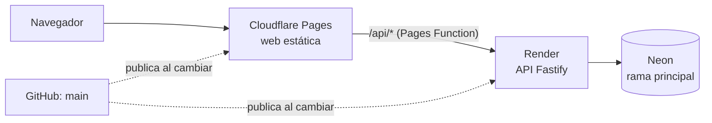

# Publicación

[Índice](README.md)

La web va en Cloudflare Pages, la API en Render y la base de datos en Neon. Cloudflare y Render publican solos cada vez que cambia `main`. Montado en el paso 0.6 (30 de septiembre de 2026).

## Neon (base de datos)

- Rama `dev`: desarrollo en local (`apps/api/.env`, fuera de git).
- Rama principal: producción. Sus dos cadenas de conexión (con `-pooler` y sin él) van en Render.

## Render (API)

1. New > Blueprint y elegir el repositorio `juananmgz/cuadrocorrocalle`: Render lee `render.yaml`.
2. Rellenar `DATABASE_URL` (cadena con `-pooler`) y `DIRECT_URL` (cadena sin `-pooler`) de la rama principal de Neon.
3. `PROXY_SECRET`: la misma clave larga y aleatoria que en Cloudflare Pages (`openssl rand -hex 32`). Con ella, la API solo atiende peticiones que llegan por la web.
4. `BETTER_AUTH_SECRET` lo genera Render (`generateValue`) y `BETTER_AUTH_URL` es la dirección pública de la web (`https://cuadrocorrocalle.pages.dev`), porque la sesión vive en una cookie de esa dirección. Si el Blueprint no se sincroniza solo, se añaden a mano en Environment.
5. Al terminar, anotar la dirección del servicio (`https://….onrender.com`).

En cada publicación se aplican las migraciones pendientes (`prisma migrate deploy`). La comprobación de salud es `/api/health`.

## Cloudflare Pages (web)

El proyecto se crea desde el enlace «Continue to Pages», no desde el flujo de Workers.

1. Workers & Pages > Create > Pages > Connect to Git y elegir el repositorio.
2. Ajustes de build:
   - Production branch: `main`
   - Root directory: `apps/web`
   - Build command: `pnpm build`
   - Build output directory: `dist`
3. Variables de entorno:
   - `NODE_VERSION`: `22.20.0`
   - `PNPM_VERSION`: `12.8.1`
   - `API_ORIGIN`: la dirección de Render, sin barra final
   - `PROXY_SECRET` (tipo «Secret»): la misma clave que en Render

**Orden al activar `PROXY_SECRET`:** primero en Cloudflare Pages (la web empieza a enviarla y la API aún la ignora) y después en Render. Al revés, la web se quedaría sin API hasta completar el segundo paso.

La función `apps/web/functions/api/[[path]].ts` reenvía `/api/*` a la API, así que el navegador solo habla con la dirección de la web. Añade la cabecera `x-client-ip` con la IP del visitante para el límite de intentos. Las cabeceras de seguridad de la web están en `apps/web/public/_headers`.
