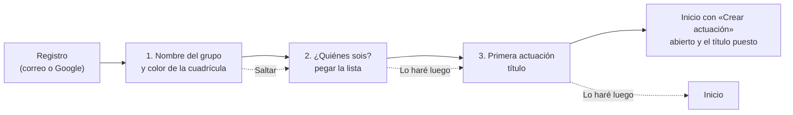

# Alta guiada

[Índice](README.md)

Paso 1.13 (caso OA-32). Una cuenta nueva no llega a una pantalla vacía: tras registrarse (con correo o con Google) entra en `/empezar`, una tarjeta en medio de la cuadrícula con tres preguntas, una a una, y una barra de progreso «Paso N de 3».

- **1. Grupo:** cambia el nombre y el color (al elegirlo, la cuadrícula lo muestra al momento con un fundido) del «Grupo de Prueba» que recibe toda cuenta nueva (sigue siendo de prueba). Si el nombre se deja vacío, se queda como estaba. «Saltar» pasa al siguiente sin cambiar nada.
- **2. Personas:** «Pegar la lista» abre el mismo diálogo que en «Mi grupo» (chicos y chicas juntos o por separado, y el rol de cada uno). Después dice cuántas personas hay en el grupo. «Lo haré luego» pasa sin añadir a nadie.
- **3. Primera actuación:** se escribe el título y «Empezar la actuación» lleva al inicio con el formulario de crear ya abierto y ese título; allí se completan el escenario y la convocatoria y se crea como siempre. «Lo haré luego» va al inicio.
- **Entrada:** el registro con correo lleva a `/empezar`; el de Google usa `newUserCallbackURL`, así que solo las cuentas nuevas pasan por aquí (desde «Entrar»). Quien ya tiene cuenta entra al inicio como siempre.
