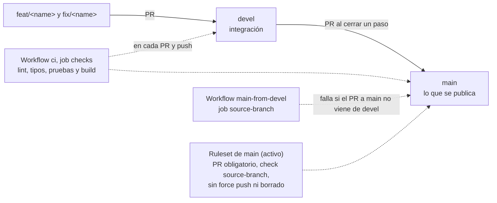

# Repositorio

[Índice](README.md)

Monorepo con pnpm 12 y Node 22 (22.13 o superior).

```mermaid
flowchart TD
  R["cuadrocorrocalle (monorepo pnpm 12, Node 22)"]
  R --> AW["apps/web"]
  R --> AA["apps/api"]
  R --> PS["packages/shared"]
  R --> DOC["documentation: esta documentación"]
  AW -->|"workspace:*"| PS
  AA -->|"workspace:*"| PS
  R --> T["Herramientas en la raíz"]
  T --> TS["TypeScript 6 (tsconfig.base.json)"]
  T --> ES["ESLint 10 (eslint.config.js)"]
  T --> ST["Stylelint 17 + SCSS (.stylelintrc.json)"]
  T --> PR["Prettier 3 (.prettierrc.json)"]
  AW --> V["Vite 8 + SCSS Modules (sass-embedded)"]
  AW --> VT["Vitest + Testing Library (jsdom)"]
  AW --> FS["src: components/, pages/, styles/ (_tokens, _mixins, global)"]
  AW --> TQ["TanStack Query; proxy de Vite /api a localhost:3000"]
  AW --> UI["components/ui: componentes sobre Radix (radix-ui), cada uno con su SCSS<br>Button, TextField, Select, Dialog, Menu, Tabs, Toast (información, éxito, peligro, error),<br>Card, PersonChip, ColorPicker (20 colores de persona), RequiredMark («(*)» de campo obligatorio)<br>iconos: siempre de Lucide (lucide-react), línea de 2 px"]
  AW --> TB["components/TopBar: logo CuadroCorroCalle; en tablet y PC recuadro del grupo (GroupBox) y menú de usuario,<br>en móvil menú hamburguesa (components/SideMenu): usuario, grupo, Mi grupo, Ajustes y Mi cuenta<br>components/AppLayout: marco de las páginas con sesión (barra, cuadrícula y grupo activo)<br>página /componentes (carga diferida)"]
  AW --> TH["src/theme: preferencia de tema guardada en el dispositivo<br>script en index.html que la aplica antes de pintar"]
  AW --> GR["src/groups: grupo activo (7 días), API de grupos, colores de cuadrícula<br>components/GroupChooser: diálogo «Elegir grupo»"]
  AW --> AU["src/auth: cliente de Better Auth y RequireAuth<br>páginas /registro, /entrar, /recuperar y /restablecer; con sesión /inicio (próxima actuación), /actuaciones y /actuaciones/:id, /grupo (Mi grupo), /ajustes (tema y cookies) y /cuenta (datos y cerrar sesión)"]
  AW --> CO["src/consent y components/CookieBanner: aviso de cookies<br>src/analytics: carga de GA4 tras aceptar"]
  AW --> EP[".env.production: VITE_GA_MEASUREMENT_ID (público)"]
  AW --> GB["components/GridBackground: cuadrícula esférica en canvas, vista cenital con el escenario;<br>publica dónde queda el escenario en pantalla (stageView)"]
  AW --> SL["components/StageLayer: fichas de las personas sobre el escenario<br>src/stage: imán a centro, lado o vértice de la casilla, 1 m entre personas, franja del borde (paso 2.1)"]
  AW --> PF["functions/api/[[path]].ts: proxy /api en Cloudflare Pages"]
  AA --> FA["Fastify con tsx; src/app.ts, src/server.ts<br>src/modules/health, auth (Better Auth), proxy, email (Brevo)<br>groups, people y performances (rutas, servicio y repositorio)"]
  AA --> VA["Vitest con app.inject"]
  AA --> PRI["Prisma 7: prisma/schema.prisma, prisma/migrations, prisma.config.ts<br>cliente generado en src/generated (fuera de git)"]
  AA --> ENV[".env local con DATABASE_URL, DIRECT_URL, BETTER_AUTH_SECRET y BETTER_AUTH_URL (fuera de git)<br>.env.example de plantilla"]
  R --> RY["render.yaml: API en Render (Frankfurt), migraciones al publicar"]
  PS --> Z["Zod 4: esquemas de salud, grupos, personas y actuaciones"]
```



## Puesta en marcha

1. Node 22.13 o superior y pnpm 12.8.1 (`npm i -g pnpm@12.8.1`).
2. `pnpm install`.
3. Copia `apps/api/.env.example` a `apps/api/.env`, pon la cadena de conexión de la rama `dev` de Neon y un `BETTER_AUTH_SECRET` propio (`openssl rand -base64 32`). La web funciona sin ellos, pero sin cuentas.

## Comandos

```bash
pnpm install     # instala las dependencias
pnpm dev         # web en http://localhost:5173 y API en http://localhost:3000
pnpm test        # pruebas
pnpm build       # compila
pnpm lint        # ESLint, Stylelint y Prettier
pnpm typecheck   # comprueba los tipos
pnpm format      # da formato al código
```

## Ramas y protección

- `feat/<nombre>` para funciones nuevas y `fix/<nombre>` para arreglos, con PR hacia `devel`.
- `devel` se fusiona en `main` al terminar un paso completo del plan.
- Commits en inglés con gitmoji y texto breve: `✨ Add cookie consent banner`. Pull requests con el título `CCC-XXXX / nombre` (número de la PR con cuatro cifras) y, en la descripción, la versión arriba y un resumen en viñetas. Ver [Versiones](changelog.md).


